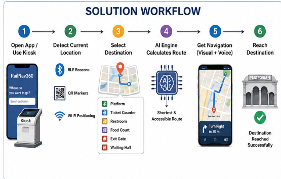
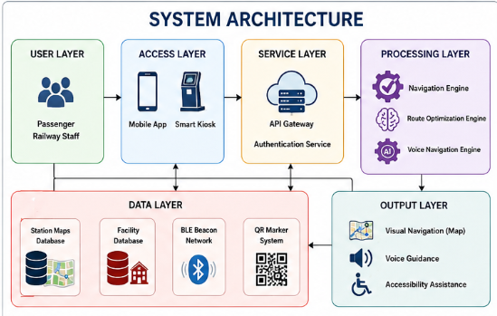
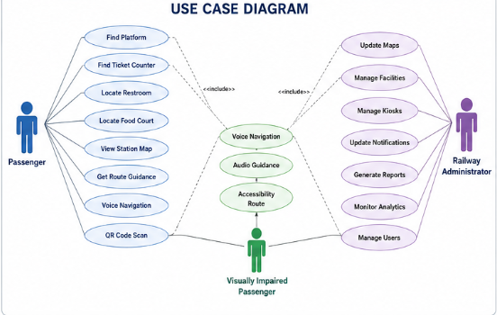
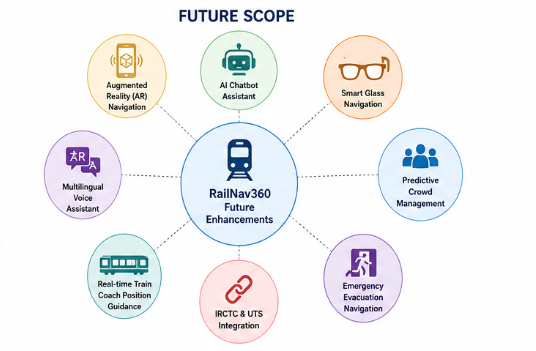

# RailNav360 – Smart Railway Navigation System

## Smart India Hackathon 2026

### Problem Statement ID

**SIH 1710**

### Problem Title

**Enhancing Navigation for Railway Station Facilities and Locations**

### Organization

**Ministry of Railways**

---

# 1. Problem Overview

Railway stations are often large and complex environments containing numerous facilities such as ticket counters, platforms, waiting halls, food courts, restrooms, exits, elevators, escalators, and help desks.

Passengers, especially first-time visitors, senior citizens, tourists, and differently-abled individuals, frequently face difficulties locating these facilities. This often results in confusion, delays, congestion, and a poor travel experience.

The objective of this project is to develop a smart navigation platform that helps passengers easily locate facilities and destinations inside railway stations through real-time indoor navigation.

---

# 2. Existing Challenges

* Difficulty locating platforms and facilities.
* Lack of indoor navigation support.
* Limited assistance for visually impaired passengers.
* Language barriers for tourists.
* Congestion during peak hours.
* Frequent layout changes are not communicated effectively.
* Time loss due to navigation confusion.

---

# 3. Proposed Solution – RailNav360

RailNav360 is an AI-powered indoor railway navigation system designed to provide accurate and real-time directions to passengers inside railway stations.

The solution consists of:

### Mobile Application

* Interactive station maps
* Facility search
* Step-by-step navigation
* Voice guidance
* QR code scanning
* Accessibility support

### Smart Digital Kiosks

* Touchscreen navigation
* Facility search
* Station maps
* Emergency route guidance
* Multi-language support

### AI Navigation Engine

* Shortest route calculation
* Accessibility route planning
* Dynamic route updates
* Crowd-aware routing

### Railway Administration Dashboard

* Update station maps
* Manage facility locations
* Monitor kiosk usage
* Generate analytics reports

---

# 4. Objectives

* Improve passenger experience.
* Reduce navigation confusion.
* Save passenger time.
* Improve accessibility.
* Reduce congestion.
* Enable real-time station navigation.
* Support visually impaired passengers.

---

# 5. Target Users

* Daily commuters
* Tourists
* First-time passengers
* Senior citizens
* Visually impaired passengers
* Physically challenged passengers
* Railway staff

---

# 6. System Workflow

### Step 1

Passenger opens the mobile application or accesses a digital kiosk.

### Step 2

Current location is detected using:

* BLE Beacons
* QR Markers
* Wi-Fi Positioning

### Step 3

Passenger selects destination.

Examples:

* Platform
* Ticket Counter
* Restroom
* Food Court
* Exit Gate

### Step 4

AI Navigation Engine calculates the optimal route.

### Step 5

Voice and visual navigation instructions are generated.

### Step 6

Passenger reaches destination successfully.

---

# 7. Solution Workflow Diagram

##  Workflow Diagram 

---

# 8. System Architecture

The system contains the following major components:

### User Layer

* Passenger
* Railway Staff

### Access Layer

* Mobile Application
* Smart Digital Kiosk

### Service Layer

* API Gateway
* Authentication Service

### Processing Layer

* Navigation Engine
* Route Optimization Engine
* Voice Navigation Engine

### Data Layer

* Station Maps Database
* Facility Database
* BLE Beacon Network
* QR Marker System

### Output Layer

* Visual Navigation
* Voice Guidance
* Accessibility Assistance

---

# 9. System Architecture Diagram

##  Architecture Diagram 

---

# 10. Use Case Analysis

### Passenger

* Find Platform
* Find Ticket Counter
* Locate Restroom
* Locate Food Court
* View Station Map
* Get Route Guidance
* Use Voice Navigation

### Visually Impaired Passenger

* Voice Navigation
* Audio Guidance
* Accessibility Route Guidance

### Railway Administrator

* Update Maps
* Manage Kiosks
* Update Facilities
* Generate Reports
* Monitor System Usage

---

# 11. Use Case Diagram

##  Use Case Diagram 

---

# 12. Technology Stack

## Frontend

* React Native
* Flutter

## Backend

* Node.js
* Express.js

## Database

* MongoDB

## Cloud Platform

* AWS

## Navigation Technologies

* BLE Beacons
* QR Codes
* Wi-Fi Positioning

## Mapping Technologies

* Mapbox
* Three.js

## AI Components

* Route Optimization
* Crowd Prediction
* Accessibility Routing

---

# 13. Key Features

### Smart Indoor Navigation

Provides accurate directions inside railway stations.

### Interactive Maps

3D station maps with real-time updates.

### Voice Navigation

Audio-based navigation support for visually impaired users.

### Accessibility Assistance

Provides routes suitable for wheelchairs and senior citizens.

### QR-Based Position Detection

Users can scan QR codes to instantly identify their location.

### Smart Kiosks

Interactive touch-screen navigation stations throughout railway premises.

### Multi-Language Support

Supports multiple regional languages.

### Real-Time Updates

Reflects changes in station layout and facilities instantly.

### Emergency Guidance

Provides evacuation routes during emergencies.

---

# 14. Expected Outcomes

* Reduced passenger confusion.
* Faster movement within stations.
* Better accessibility.
* Improved passenger satisfaction.
* Reduced congestion.
* Enhanced railway digital infrastructure.

---

# 15. Future Enhancements

* Augmented Reality Navigation
* AI Chatbot Assistant
* Smart Glass Navigation
* Predictive Crowd Management
* Emergency Evacuation Navigation
* IRCTC Integration
* Real-Time Train Coach Position Guidance

---

# 16. Future Scope Diagram

##  Future Scope Diagram 

---

# 17. Conclusion

RailNav360 provides a comprehensive and intelligent railway station navigation system that enhances passenger convenience, improves accessibility, reduces congestion, and supports India's vision of smart railway infrastructure. By integrating mobile applications, smart kiosks, AI-powered routing, voice assistance, and real-time updates, the system creates a seamless and inclusive navigation experience for all railway passengers.
